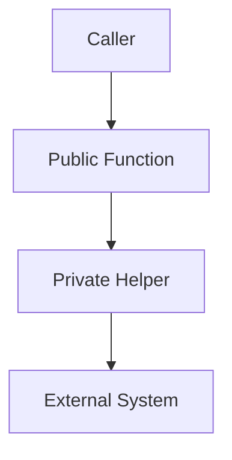

# Diagrams

Diagrams MUST be stored as **text‑based sources** (ASCII or Mermaid) whenever possible.

## Mermaid Diagrams

Use Mermaid syntax for flows and relationships:

Source files SHOULD live under:

- `assets/mermaid/` for Mermaid definitions.
- `assets/ascii/` for ASCII art.
